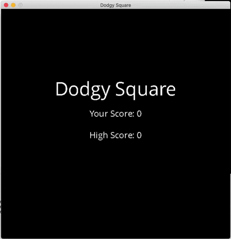

# Dodgy Square

This is my capstone submission for the Udacity C++ course. I chose to pursue the game option for the capstone project. I have used SDL2 and made a very simple game I call 'Dodgy Square'. The game play is very straight-forward. The player is the green square and you must dodge the falling red squares. You can move the player object (green square) using the AWSD keys.
* A = Left
* D = Right
* S = Down
* W = Up
* Spacebar = Start game

The game will start on the title screen where the high score is shown and the user score is shown as well as the title of the game. Simply press the spacebar to start the game.

## Dependencies

## Basic Build Instructions
1. git clone https://github.com/novacekn/DodgySquare
2. cd DodgySquare
3. mkdir build && cd build
4. cmake .. && make
5. ./DodgySquare

## Code Structure